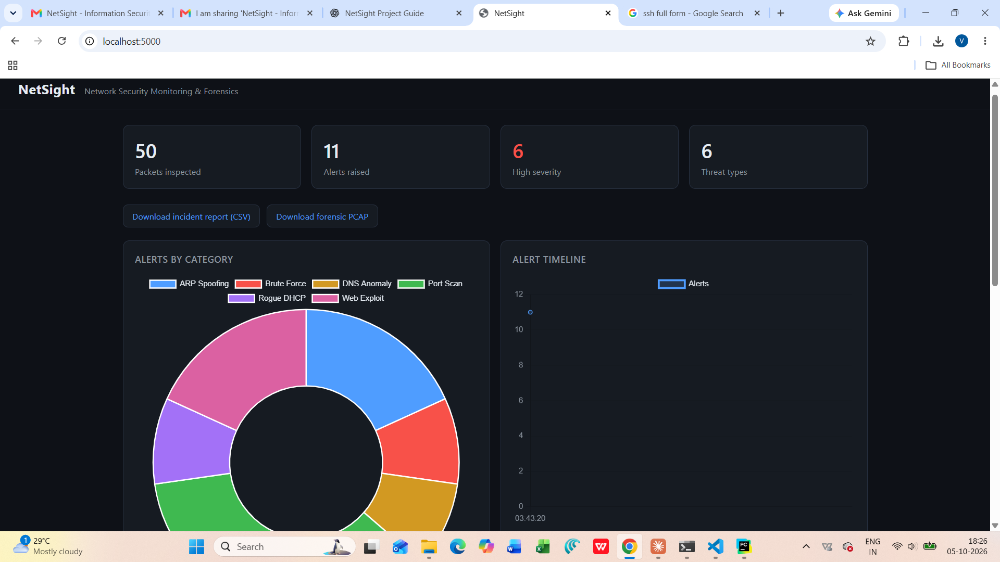
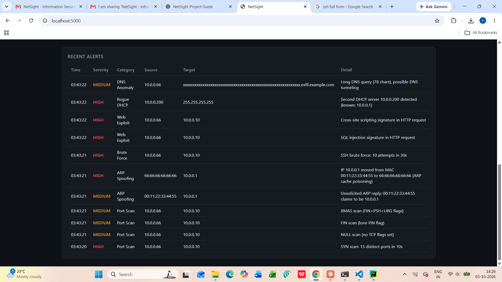

# NetSight

**A custom packet-level intrusion detection and forensic analysis platform for an emulated enterprise network.**

NetSight captures network traffic, detects Layer-2 to Layer-7 attacks in real
time with a custom Python engine, stores forensic evidence, and presents
everything on an interactive web dashboard — replacing a pile of disconnected
tools with one lightweight pipeline.

> Information Security Lab — Mini Project
> Team: Gahna Bisht · Varda Murarka · Vishad Sharma

---

## Architecture

```
   +----------------+        +----------------+
   |  Attacker VM   |        |   Victim VM    |
   |  Kali          |        |   Ubuntu       |
   |  10.0.0.66     |        |   10.0.0.10    |
   |                |        |   Apache :80   |
   |                |        |   SSH    :22   |
   +-------+--------+        +--------+-------+
           |                          |
           +------------+-------------+
                        |
             Internal Network (netsight-lab)
                        |
                        v
             +---------------------+
             |   NetSight Sensor   |
             |---------------------|
             |  Capture (Scapy)    |
             |        |            |
             |  Detection engine   |   6 detectors
             |        |            |
             |  SQLite storage     |
             |        |            |
             |  Flask dashboard    |
             +----------+----------+
                        |
         +--------------+--------------+
         |              |              |
     Live alerts   Forensic PCAP   CSV report
```

The sensor reads every packet, runs it through six detectors, logs metadata and
normalized alerts to SQLite, keeps the attacking packets as forensic evidence,
and serves the dashboard.

---

## Features

### Implemented (current)

- **Six detection modules** covering Layer 2 to Layer 7:
  - Port scanning — SYN, NULL, FIN, XMAS (sliding-window + illegal-flag logic)
  - ARP spoofing / cache poisoning — IP↔MAC binding checks
  - SSH / SNMP brute force — connection-rate heuristics
  - Web exploits — SQL injection and XSS signature matching
  - DNS anomalies — tunneling (long query names) and flooding
  - Rogue DHCP — detects a second DHCP server on the network
- **Dual input** — analyse a saved `.pcap` file **or** capture live traffic.
- **SQLite storage** of indexed packet metadata and normalized alerts.
- **Forensic PCAP export** — only the flagged (malicious) packets, for evidence.
- **CSV incident report** — downloadable timeline of every alert.
- **Interactive dashboard** — live counters, alerts-by-category chart, alert
  timeline, and a searchable recent-alerts table (Flask + Chart.js).
- **Test-traffic generator** — crafts a sample capture of every attack type so
  the whole pipeline can be verified on one machine, no VMs required.

### Planned (final scope)

- Multi-VLAN testbed with pfSense/OPNsense firewall and SPAN mirroring
- Suricata / Zeek benchmarking against the same captures
- PCAP upload directly from the dashboard
- Real-time email / desktop alerting on high-severity events
- SSH honeypot (Cowrie) integration for attacker telemetry
- Machine-learning anomaly detection alongside the rule engine

---

## Screenshots

**Dashboard overview**



**Recent alerts**



---

## Tech stack

| Layer | Technology |
|-------|-----------|
| Language | Python 3 |
| Packet capture / parsing | Scapy |
| Storage | SQLite |
| Web dashboard | Flask + Chart.js |
| Lab | VirtualBox, Kali Linux, Ubuntu |
| Live capture driver (Windows) | Npcap |

---

## Prerequisites (what to download)

1. **Python 3** — https://www.python.org/downloads/
   (On Windows, tick **"Add python.exe to PATH"** during install.)
2. The Python libraries in `requirements.txt` (installed below).
3. **Npcap** — https://npcap.com/#download — *only* needed for live capture on
   Windows. Not required to analyse a `.pcap` file.

For the full lab (attacker + victim VMs), see `GUIDE.md`.

---

## Installation

```bash
# clone your repository
git clone https://github.com/<your-username>/netsight.git
cd netsight

# install dependencies
pip install -r requirements.txt
```

---

## Usage

**1. Verify everything works (no VMs needed):**

```bash
python gen_test_traffic.py                    # creates test.pcap
python netsight.py capture --pcap test.pcap --serve
```

You should see all six alert categories print, then the dashboard opens at
**http://127.0.0.1:5000**.

**2. Analyse any capture file:**

```bash
python netsight.py capture --pcap <file.pcap>
```

**3. Capture live traffic** (needs Npcap on Windows, or run on a Linux sensor):

```bash
python netsight.py capture --iface "Ethernet" --serve
```

**4. Open the dashboard for an existing database:**

```bash
python netsight.py dashboard
```

---

## Project structure

```
netsight/
├── netsight.py          # entry point: capture engine + CLI
├── detectors.py         # the six detection modules
├── storage.py           # SQLite persistence
├── dashboard.py         # Flask dashboard + exports
├── config.py            # tunable detection thresholds
├── gen_test_traffic.py  # synthetic test capture generator
├── templates/
│   └── dashboard.html   # dashboard UI (Chart.js)
├── requirements.txt
├── README.md
├── GUIDE.md             # full setup + team work division
└── docs/                # screenshots
```

---

## Team & responsibilities

| Member | Role |
|--------|------|
| **Varda Murarka** | Detection engine, forensics, and dashboard (the core platform) |
| **Vishad Sharma** | Attacker VM, network setup, Suricata benchmarking |
| **Gahna Bisht** | Victim VM + services, demo attacks, diagram, documentation |

Full step-by-step setup, the demo script, and the detailed work division are in
**[GUIDE.md](GUIDE.md)**.
